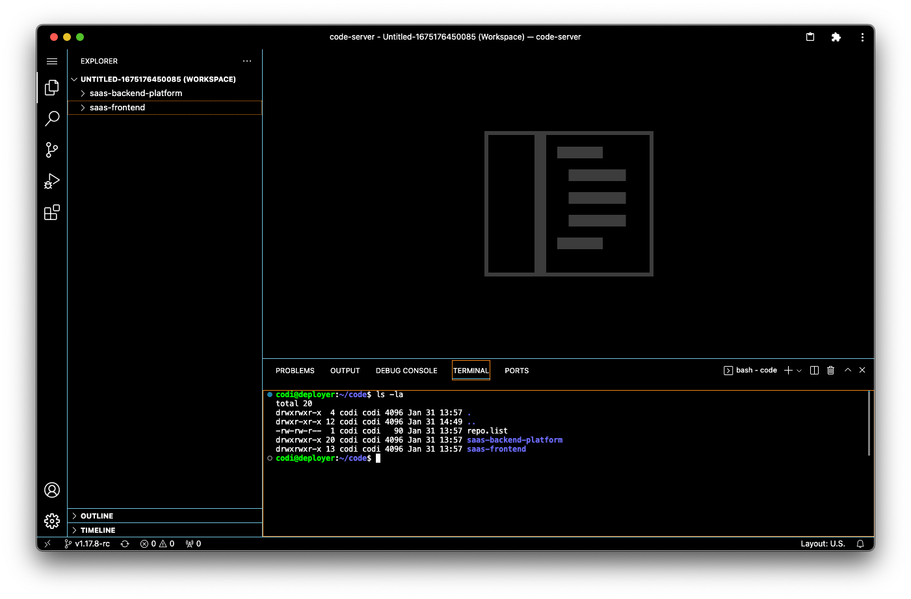

---

For those times when:
1. you need a ready to use server with a little more horse power
2. are tired of fighting network bandwidth issues working with container images while you work.
3. **need to setup a development environment now _with the code checked out ready for development_.**
4. want to `mob-program` with friends (at the same time on the same code)

Then you need to deploy a `Mob Server`.

**This repository makes it possible in less than 10 minutes.**

It will:
* deploy an EC2 instance or Spot instance running 
* expose [Code Server](https://github.com/cdr/code-server)
* check out your code, and add a new SSH key to your gitlab account
* update your `.ssh/config` file
* generate a secure password for the machine
* make it accessible at a real DNS location

The default configurations cost less than a $1USD per day in most regions. Upgrading disk size to `128G` with a `t3a.xlarge` is closer to $4 a day.


**_I love this project, I hope you do too._**



---

Deplyment Quick Start
=====================

## Prerequisites

**Collect the following for fast setup**
| No.   | What              | Description                        |
| ----- | -------------------------- | ---------------------------------- |
| [ ]   | [Pulumi Installed and an Token](https://www.pulumi.com/)  | They have a `curl-pipe-shell` install, and token setup as soon as you login. The account is free, easy to use, and helps you track your deployments and resource allocations. _This is the core of the automation in this repository._
| [ ]   | [Gitlab Personal Token](https://kp2.in.htwg-konstanz.de/git/help/user/profile/personal_access_tokens.md)      |  The personal access token is used to add / delete your SSH key.
| [ ]   | [An AWS Account](https://docs.aws.amazon.com/cli/latest/userguide/install-cliv2.html) | make sure your credential are setup.
| [ ]   | AWS VPC ID                 | Record the VPC ID for the AWS region you want to deploy in.
| [ ]   | AWS Hosted Zonename        | This is in the Route53 settings. eg. `dev.example.com`
| [ ]   | [Golang](https://golang.org/doc/install) | you must have a recent version of golang on your machine, and locatable using the the `PATH` environment variable


---

Configuration
================

### 1. Export your AWS Credentials
```
export AWS_ACCESS_KEY_ID=<YOUR_ACCESS_KEY_ID>
export AWS_SECRET_ACCESS_KEY=<YOUR_SECRET_ACCESS_KEY>
export AWS_REGION=<YOUR_DESIRED_REGION>
```

### 2. Export your Pulumi Token
```
export PULUMI_ACCESS_TOKEN=<YOUR_TOKEN>
```

### 3. Initialize a new `Pulumi Stack`

* **Make sure the go modules are available**
    ```bash
      STACK=mystackname make stack
    ```
    > _**replace `mystackname` with a name of your choosing**_


### 4. Setup your configuration by Editing the [configuration file](./config/configuration.yml). Set or review the following:

| WHAT                                          | DESCRIPTION                |
| --------------------------------------------- | -------------------------- | 
| `aws:region`                                  | Set to the region where the VPC resides
| `mob-server:settings::hosted_zone`            | your AWS the hosted zone name (eg. `dev.example.com`) from route 53
| `mob-server:settings:email`                   | this used to setup git and for your Let's Encrypt Certificate 
| `mob-server:settings::instance:vpc_id`        | AWS VPC ID in the region you are deploying too
| `mob-server:settings::instance:disk_size`     | Disk size on the machine (recommend 128)
| `mob-server:settings::instance:instance_type` | The machine size. I recommend `t3a.large` for light work, `t3a.xlarge` for intense CPU/IO heavy development.
| `mob-server:settings::instance:hostname`      | The name of the host. This is the prefix for your total DNS name. Such as `cod.dev.example.com`.
| `mob-server:settings::instance:developer`     | Name of the user you want to be on the machine (_developer is a nice name_)
| `mob-server:settings::gitlab:username`        | Your gitlab username
| `mob-server:settings::gitlab:repositories`    | The list of repositories you wanted checked on when you create the machine. 

> Save when done.

**AND finally add your gitlab token in a secure, encrypted form**
```console
# Encrypt your token in the configuration file
export GITLAB_ACCESS_TOKEN=XXXX
pulumi config --config-file config/configuration.yml set --secret --path 'settings.gitlab.token' "$GITLAB_ACCESS_TOKEN"
```

### 5. **Deploy the Server**
```console
make deploy
```
> When done, go to the "First Login"

---

First Login
===============

You machine is setup, now you need to get into it. These steps will get you the password, and allow you to login.

### 1. Get your generated `password from the machine`:

```bash
ssh cod.dev.example.com cat /home/gunner/.config/code-server/config.yaml
```
> Note in this example I used my machine DNS name, and the `instance.username` from my config file.

_example output_:
```console
    ...
    Warning: Permanently added 'cod.dev.example.com,44.201.186.84' (ECDSA) to the list of known hosts.
    disable-telemetry: true
    link: false
    auth: password
    password: Mjk2NjBhY2E3Zjg4
```

### 2. Login for the first time, by opening your browser to the machine:
```
open https://cod.dev.example.com
```
> Paste in the `password` value obtained by SSH


### 3. Setup the server to your liking
1. Install VSCode plugins you use
2. Set the Theme
3. Load the code available in the `code` directory.


Shutdown Your Resources
=======================

We only have one plant so use resources wisely and shut it down when you don't need it:

```
make destroy
```


