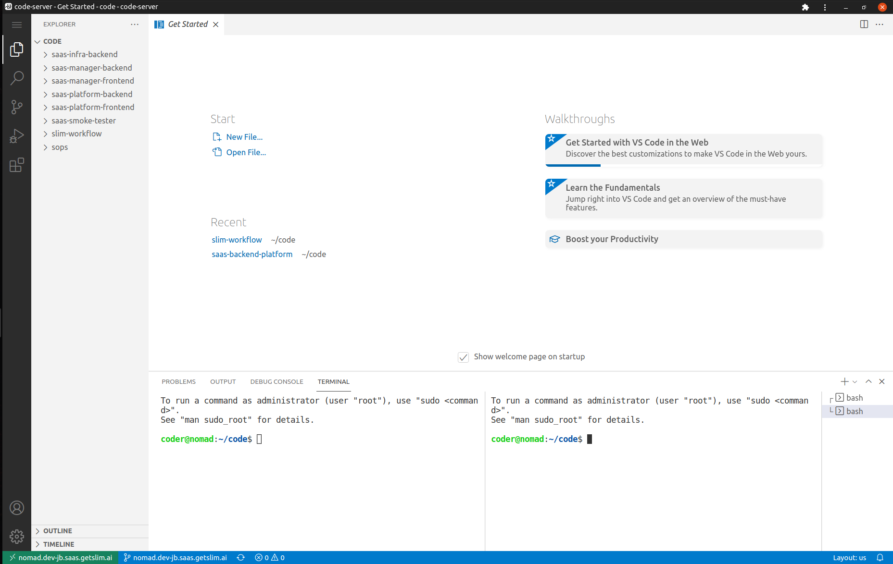

---

For those times when you need a ready to use server with a little more horse power, than your ipad provides.

Or better yet, when you need to `Mob Program` with friends! Mob programming is a software development approach where the whole team works on the same thing, at the same time, in the same space, and at the same computer.

This repository makes it possible to quickly deploy an EC2 (spot) instance running [Code Server](https://github.com/cdr/code-server) for just such a purpose.

This setup is **_CHEAP!_** The default configurations cost less than a $1USD per day in US regions.

It works equally well if you are on an iPad, Linux box - or behind terrible internet preventing you from developing as fast as you desire.

Or better yet, never deal with machine setup again when you onboard a team member.

Through configuration, this project:
* provision and manage local SSH keys, and `.ssh/config` file, for rapid access to the server.
* provision and manage a [gitlab](gitlab.com) SSH key
* setup code server, with real/validated LetsEncrypt certificates
* expose the server using real DNS names
* check out your code repositories (if specified in the configuration file)
  > and commits any uncommitted changes upon destruction of the server.


> *foot note:* this is derivative work by awesome open source projects from:
> * pulumi.com
> * coder.com
>
> check `em out

**_I love this project, I hope you do too._**




## Prerequisites
* [Make](https://formulae.brew.sh/formula/make) - makefile automation support
* [Golang](https://golang.org/doc/install) - install go and ensure it is on your PATH
* [Pulumi](https://www.pulumi.com/docs/get-started/install/) - install client, setup and account, and get a token from the settings menu.
* [An AWS Account and credentials configured](https://docs.aws.amazon.com/cli/latest/userguide/install-cliv2.html), and setup credentials

## Quick Start

* **Make sure the go modules are available**

    ```bash
    export AWS_ACCESS_KEY_ID=<YOUR_ACCESS_KEY_ID>
    export AWS_SECRET_ACCESS_KEY=<YOUR_SECRET_ACCESS_KEY>
    export AWS_REGION=<YOUR_DESIRED_REGION>
    go mod tidy
    go mod vendor
    ```

* **Make a Pulumi stack**
    > This is important, as the secrets below will be tied to the stack - and only available to you for that stack.

    ```
    make stack
    ```

---

## Setup your Configuration

### Mandatory Values

You must set at a minimum the following configuration values
* `settings.hosted_zone`       - your AWS hosted zone (prerequisite)
* `settings.email`             - your email for LetsEncrypt Certificate
* `settings.gitlab.enabled`    - must be set (until github is supported)
* `settings.gitlab.username`   - your `username` for git configuration
* `settings.gitlab.token`      - a [gitlab personal token](https://docs.gitlab.com/ee/user/profile/personal_access_tokens.html) used to manage the SSH cert for the new machine

### All values (include optional values)

The following example shows all optional values.

```bash
cd cmd
CONFIG_FILE="../config/configuration.yml"
## Setup the zone info
pulumi config --config-file ${CONFIG_FILE} set aws:region us-west-2
pulumi config --config-file ${CONFIG_FILE} set --path 'settings.hosted_zone' example.com
pulumi config --config-file ${CONFIG_FILE} set --path 'settings.email' my@email.com

## Define the machine profile
pulumi config --config-file ${CONFIG_FILE} set --path 'settings.instance.hostname' seattle
pulumi config --config-file ${CONFIG_FILE} set --path 'settings.instance.vpc_id' vpc-ABCDIDREFESSDF
pulumi config --config-file ${CONFIG_FILE} set --path 'settings.instance.username' coder
pulumi config --config-file ${CONFIG_FILE} set --path 'settings.instance.instance_type' t3a.large
pulumi config --config-file ${CONFIG_FILE} set --path 'settings.instance.os_dist' ubuntu
pulumi config --config-file ${CONFIG_FILE} set --path 'settings.instance.disk_size' 128
# Setup creds locally (if you don't set these a new cert will be generate)
pulumi config --config-file ${CONFIG_FILE} set --path 'settings.instance.credentials.public' "ssh-ed25519 YOUR KEY HERE..."
# Now setup the private cert - must be base64 (This will be used to provision post deployment)
PRIVATECERT=$(cat ~/.ssh/code-server.rsa | base64)
pulumi config --config-file ${CONFIG_FILE} set --secret --path 'settings.instance.credentials.private' "${PRIVATECERT}"

## Setup your github creds
pulumi config --config-file ${CONFIG_FILE} set --path 'settings.github.enabled' false

## Setup your gitlab creds
pulumi config --config-file ${CONFIG_FILE} set --path 'settings.gitlab.enabled' true
pulumi config --config-file ${CONFIG_FILE} set --path 'settings.gitlab.username' mygitlabusername
pulumi config --config-file ${CONFIG_FILE} set --secret --path 'settings.gitlab.token' "glpat-SECRET_TOKEN"

## Setup some repositories to pull on build of the server
pulumi config --config-file ${CONFIG_FILE} set --path 'settings.gitlab.repositories[0]' "git@gitlab.com:myorg/some-cool-project.git"
pulumi config --config-file ${CONFIG_FILE} set --path 'settings.gitlab.repositories[1]' "git@gitlab.com:myorg/another-cool-project.git"
```

> Note when you are done - it is possible to commit this file (recommended on a brach - on a private fork).
> The values are encrypted by pulumi when using the `--secret` flag; which means only you can access these value.

---

## Deploying the Server

```
make deploy
```

**Example**


---

## Access the System

* **SSH to the machine to get the credentials**
    > Note that if you didn't provide an SSH certificate - one is created for you, and the `.ssh/config` file is configured accordingly.
    >
    > Next you will need the **password** for logging into your code server.
    > The example below demonstrates this.

    ```bash
    $ ssh nomad.dev-jb.saas.getslim.ai cat /home/coder/.config/code-server/config.yaml

    The authenticity of host 'nomad.dev-jb.saas.getslim.ai (44.201.186.84)' can't be established.
    ECDSA key fingerprint is SHA256:vJdqoIhoPfsoxAQSbtQN3a3c/+THWZUJsq7ZdpusutE.
    Are you sure you want to continue connecting (yes/no/[fingerprint])? yes
    Warning: Permanently added 'nomad.dev-jb.saas.getslim.ai,44.201.186.84' (ECDSA) to the list of known hosts.
    disable-telemetry: true
    link: false
    auth: password
    password: Mjk2NjBhY2E3Zjg4
    ```

* **Open your browser to your code server**:

    ```
    open https://nomad.dev-jb.saas.getslim.ai
    ```
    > **Hints**
    > * On Mac/iPad you can save the tab to the desktop - which gives you a native VSCode experience.
    >
    > * On Linux - you can do a similar thing when using chrome.
    >
    > * Windows Users - you are on your own - I haven't touched a Windows box in about a decade.

---

## Access Your Code Repositories

If you defined repositories in the [configuration](config/configuration.yml) file, they will have been checked out to the `/home/coder/code` directory.


---

Shutdown (and Save the Planet)
=============================

This setup is so cheap, it is hard to complain about price - but energy usage costs more than just $$$.

Save our planet, and shut resources down when you are not using them. **No worries, this project will commit your code when you destroy the server (_milage may very(tm)_):

```
make destroy
```

---

## Security Disclaimer

No effort has been put into making this secure more than random passwords, and using native pulumi encryption. That said, a lot can be done. If you find something (say something), and if I don't have cycles -I would love any PRs you post.

If you have cool ideas - don't be a stranger - Reach out!

